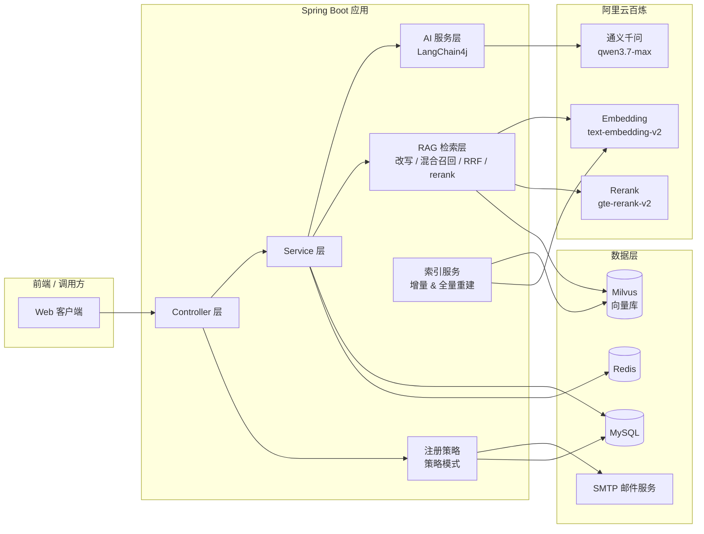

<div align="center">

# 🚀 salary-leap

**程序员闯关加薪 · 一场由 AI 出题的薪资跃迁游戏**

> 注册初始薪资 10k，闯关答题决定你的加薪 / 减薪，最终凭实力登上排行榜。
> 每一道关卡、每一份报告，都由大模型（通义千问）为你量身生成，并优先基于真实技术知识库出题。

[](https://spring.io/projects/spring-boot)
[](https://openjdk.org/)
[](https://baomidou.com/)
[](https://docs.langchain4j.dev/)
[](https://milvus.io/)
[](https://www.mysql.com/)
[](https://redis.io/)
[](https://doc.xiaominfo.com/)
[](./LICENSE)

</div>

---

## 📖 项目简介

`salary-leap` 是一个「程序员闯关加薪」游戏化学习项目。每位用户注册后拥有 **10k 初始薪资**，通过完成由大模型实时生成的编程关卡来提升（或降低）自己的薪资水平，最终按薪资高低生成实时排行榜。

整个闭环由 AI 驱动：**关卡是 AI 出的，报告是 AI 写的，加薪还是减薪是 AI 根据你的作答评判的。**

```
注册 → 初始薪资 10k → AI 出题（RAG 知识增强）→ 闯关作答 → AI 生成报告 → 调整薪资 → 排行榜
```

出题环节不是让模型凭空发挥：先从真实技术知识库（96 篇 Java / 并发 / JVM / MySQL / Redis / Spring 等文章）中**检索**相关内容，再**增强**进提示词，最后才交给大模型生成题目——这套 RAG 链路支持混合检索、重排序、增量更新，并配有**离线评估体系**量化每次改动的效果。

---

## ✨ 核心特性

### AI 出题闭环

- 🧠 **AI 驱动闭环**：基于 LangChain4j 接入阿里云百炼（通义千问 `qwen3.7-max`），关卡生成、作答报告全由大模型实时产出，题目永不重复。
- 📚 **RAG 知识增强出题**：出题前从 Milvus 向量库检索真实技术文档，让题目有据可依、不编造；检索失败自动降级为纯模型出题，主流程永不被拖垮。
- 🎯 **关卡池设计**：AI 生成、预置兜底、人气推荐统一沉淀到 `Level` 表，`priority` 字段区分权重，一套流程复用到底。
- 🎭 **幽默评价**：报告评价风趣诙谐（升职加薪 / 减薪 / 直接开除 / 公司给你），投递建议自动「谐音化名」规避真实公司名。

### RAG 检索链路

- 🔍 **四步检索**：查询改写 → 混合召回（向量 + BM25）→ RRF 融合 → rerank 精排 → 来源多样性去重。
- ⚡ **增量更新**：基于来源指纹的差分比对，内容没变的文档一个 embedding 调用都不发；全量重建走「新建集合 + 成功才切引用」，失败不影响线上。
- 📊 **离线评估**：30 条评估集 × 7 种检索变体，一次跑出 Hit@K / MRR / Recall / Precision / Diversity / 耗时，并自动与上次结果做差。

### 工程与安全

- 🏆 **实时排行榜**：按薪资降序排名，闯关越多、答得越准、薪资越高。
- 📈 **答题成长记录**：统计作答次数、平均分、累计薪资变化，历史记录一页尽览。
- 🔐 **安全加固**：密码 BCrypt 加密存储，Session + Cookie 登录态（Redis 分布式 Session），接口统一鉴权。
- 📮 **双通道注册**：密码注册 / 邮箱验证码注册，策略模式优雅扩展。
- 📚 **丝滑接口文档**：Knife4j + SpringDoc 在线调试，`/api/doc.html` 一键直达。

---

## 🏗️ 系统架构



---

## 🧰 技术栈

| 分类 | 技术 | 版本 | 说明 |
|------|------|------|------|
| 语言 | Java | 21 | 编译运行需 JDK 21 |
| 框架 | Spring Boot | 3.5.5 | 核心框架 |
| ORM | MyBatis-Plus | 3.5.13 | 数据访问、逻辑删除 |
| 数据库 | MySQL | 8.0 | 业务数据存储 |
| 缓存 / 会话 | Redis + Spring Session | 7.x | 分布式 Session、验证码缓存 |
| AI 框架 | LangChain4j | 1.4.0-beta10 | 接入通义千问、Embedding、Rerank |
| 对话模型 | 通义千问 | qwen3.7-max | 出题 / 报告 / 查询改写 |
| 向量模型 | text-embedding-v2 | — | 1536 维，已归一化（内积 ≈ 余弦） |
| 重排模型 | gte-rerank-v2 | — | 检索候选精排 |
| 向量库 | Milvus | 2.5.27 | 知识片段向量存储（Docker 部署） |
| 关键词检索 | BM25 | 自研内存索引 | 混合检索的字面召回一路 |
| 本地缓存 | Caffeine | 由 Boot 管理 | 检索结果缓存 |
| 接口文档 | Knife4j / SpringDoc | 4.4.0 / 2.8.17 | 在线 API 调试 |
| 安全 | spring-security-crypto | 6.x | BCrypt 密码加密 |
| 邮件 | spring-boot-starter-mail | — | 邮箱验证码 |
| 工具 | Hutool | 5.8.38 | 通用工具 |
| 爬虫 | Jsoup | 1.17.2 | 网页正文抓取入库 |
| 简化 | Lombok | 1.18.38 | 减少样板代码 |

---

## 🔍 RAG 检索增强

出题的质量上限，取决于「喂给模型的知识」。这一层负责把知识库里的相关片段准确捞出来。

### 四步检索链路

```
学习方向 "Java后端开发"
  │
  ├─① 查询改写   短标签「Java后端开发」召回不出知识广度，
  │             用 LLM 扩展成 4 条具体主题查询（原查询始终排第一）
  │
  ├─② 混合召回   每条查询 × 2 路：
  │               · 向量检索  —— 查「语义相近」（Milvus，召回 20 条）
  │               · BM25 检索 —— 查「字面命中关键词」（内存索引，召回 20 条）
  │
  ├─③ RRF 融合   score(d) = Σ 1/(60 + rank)，按排名而非分数融合，
  │             多路都排在前面的片段自然浮上来 → 截断到 30 条候选
  │
  └─④ rerank 精排  用【原查询】给候选打分，取最相关 top 3
                  同一篇文章最多占 1 个位置（避免相邻片段语义重叠刷屏）
```

**为什么这么设计：**

- **查询改写**解决「短标签召回不出广度」——`Java后端开发` 这种标签直接检索，召回的知识面很窄。
- **混合检索**解决单一召回的盲区——向量擅长语义、BM25 擅长术语命中，两路互补。
- **RRF 融合**免疫量纲差异——向量余弦分在 `[-1,1]`、BM25 分无上界，直接相加需先归一化再调权重；RRF 只看「谁排前面」，无需调参。
- **来源多样性 `selectDiverse`**——切片参数 `chunk=500 / overlap=100`，同篇相邻片段自带 100 字重叠，放任一篇占满 top-3 等于把格子浪费在近似重复上；不同来源不足时会用重复片段补齐，宁可有重复也不缺知识。

### 知识库与索引管理

知识来源分两类，统一入库：

| 来源 | 内容 | 元数据键 |
|------|------|----------|
| classpath 文本 | `knowledge/{java-backend,frontend,testing}.txt` | `file_name` |
| 网页正文 | `rag.web.urls` 配置的 93 个页面，经 Jsoup 抓取、缓存到 `docs/web/` | `url` |

索引写入有两种方式：

| 方式 | 接口 | 行为 |
|------|------|------|
| **增量更新**（默认） | `POST /rag/rebuild` | 集合不变，只对「内容变了的来源」重新 embedding，先删该来源旧片段再插新的。依据是**来源指纹**——指纹一致就一个 embedding 调用都不发 |
| **全量重建** | `POST /rag/rebuild?full=true` | 新建集合灌入全部来源，成功后才切引用，中途失败线上索引原封不动 |

入库状态**不依赖 Milvus 统计接口**（`row_count` 只统计已 flush 数据，会把刚重建的集合误判为空），而是认两个自维护文件：

| 文件 | 作用 |
|------|------|
| `milvus-current-collection.txt` | 当前生效的集合名 + 段数，重启据此复用集合、避免重复入库 |
| `milvus-index-manifest.txt` | 每个来源的正文指纹 + 片段数，增量更新的差分依据 |

> `BM25Index` 是纯内存索引，进程重启即失效，因此每次启动都会无条件重建。

### 离线评估：改完到底有没有变好

改动检索参数后「有没有变好」不能靠肉眼比 top-3 来源。这套评估把主观判断变成可复现的数字：

```
评估集(30 条) × 变体(7 种) → 走真实检索链路 → 指标计算 → 报告(report.md/json) + 与上次做差
```

**7 种变体**（`EvalVariant` 枚举，定义在 Java 里，类型安全）：

| id | 含义 | 改了什么 |
|----|------|---------|
| `all-on` | 全开（**= 生产基线**） | 无 |
| `no-rewrite` | 关查询改写 | `rewrite=false` |
| `no-hybrid` | 关混合检索（只剩向量一路） | `hybrid=false` |
| `no-rerank` | 关 rerank 精排 | `rerank=false` |
| `vector-only` | 裸向量（改造前的形态） | `hybrid=false, rerank=false` |
| `no-diversity` | 全开但不限制同一来源 | `maxPerSource=0` |
| `topk-5` | 全开但取前 5 条 | `topK=5` |

**指标**：

| 指标 | 大白话 |
|------|--------|
| **Hit@K** | 十道题做对几道 |
| **MRR@K** | 正确答案平均排第几 |
| **Recall@K / Precision@K** | 该找的都找到了吗 / 找来的有多少是干货 |
| **Diversity@K** | 三个格子被几篇文章占了 |
| **AvgReturned / EmptyRate** | 平均返回几条 / 有几道题一条都没捞到 |
| **Latency p50/p95** | 快不快、有没有长尾 |

**关键设计**：评估走**独立入口** `retrieveSegments(query, options, strict)`，不读不写缓存（否则变体之间互相污染）、`strict=true` 时不吃降级（否则「接口挂了」和「真的检索不到」在报告里长得一样）。未命中会分类成「**不在库**」（补数据）/「**检索漏掉**」（调检索）/「**调用失败**」（看日志）。

> 详细原理与用法见 [`knowledge/25-评估集与指标.md`](knowledge/25-评估集与指标.md)。

---

## 📁 项目结构

```
salary-leap
├── frontDoc/                 # 前端接口文档（登录/关卡/排行/记录）
├── knowledge/                # 开发过程沉淀文档（模块演进记录 00~25）
├── prompt/                   # AI 提示词（关卡生成 / 报告生成）
├── sql/                      # 建表脚本 + 预置题库
├── docs/
│   ├── web/                  # 网页正文抓取缓存
│   └── rag-eval/             # 评估集 + 评估报告输出
├── docker-compose.yml        # Milvus（etcd + minio + standalone）
└── src/main/
    ├── java/com/xiaohua/
    │   ├── annotation/       # 自定义注解（鉴权）
    │   ├── common/           # 统一返回、错误码、分页
    │   ├── config/           # 配置（AI / RAG / CORS / MyBatis-Plus / JSON / 密码）
    │   ├── constant/         # 常量（AI 提示词 / 缓存 Key / 预置题 / 用户角色）
    │   ├── controller/       # 接口层（User / Level / Rank / Record / RagIndex / RagEval）
    │   ├── exception/        # 全局异常处理
    │   ├── mapper/           # MyBatis-Plus Mapper
    │   ├── model/            # entity / dto / vo / ai / eval / enums
    │   ├── service/          # 业务层
    │   │   ├── ai/           # AI 服务接口（出题 / 报告 / 查询改写 / rerank 评分）
    │   │   ├── eval/         # 离线评估（评估集加载 / 指标 / 报告渲染）
    │   │   ├── loader/       # 网页文档加载器
    │   │   ├── impl/         # 业务实现
    │   │   ├── KnowledgeService.java    # 检索核心（四步链路）
    │   │   ├── RagIndexService.java     # 索引生命周期（增量/全量）
    │   │   ├── Bm25Index.java           # BM25 关键词索引
    │   │   └── QueryRewriter.java       # 查询改写
    │   ├── strategy/         # 注册策略（密码 / 邮箱）
    │   └── utils/            # 工具类
    └── resources/
        ├── knowledge/        # 内置知识文本（兜底来源）
        ├── mapper/           # 自定义 SQL XML
        └── application*.yml  # 多环境配置
```

---

## 🗂️ 数据模型

| 表 | 实体 | 作用 |
|----|------|------|
| `user` | `User` | 用户，含 `salary`（当前薪资） |
| `level` | `Level` | 关卡池（需求描述 + options JSON + 难度 + 目标薪资 + 优先级） |
| `user_level` | `UserLevel` | 作答记录（分数、评价、薪资变化、投递建议、正确选项） |

> 完整建表脚本见 [`sql/create_table.sql`](sql/create_table.sql)，预置题库见 [`sql/preset_level.sql`](sql/preset_level.sql)。

---

## 🚀 快速开始

### 环境要求

- **JDK 21**（务必确认 `JAVA_HOME` 指向 JDK 21，JDK 11 会报「不支持发行版 21」）
- **MySQL 8.0**（默认 `localhost:3306/salary_leap`，账号 `root/root`）
- **Redis 7.x**（默认 `localhost:6379`）
- **Milvus 2.5.27**（默认 `localhost:19530`，用下方 `docker-compose.yml` 一键起）
- **阿里云百炼 API Key**（跑通 AI 的前提，见下方配置）

### 1. 初始化数据库

```bash
mysql -uroot -proot < sql/create_table.sql
```

### 2. 启动 Milvus 向量库

```bash
docker compose up -d          # 拉起 etcd + minio + milvus-standalone
```

> 首次启动约需 1~2 分钟，`docker compose ps` 看到 `milvus-standalone` 健康即就绪。
> Milvus 管理界面：`http://localhost:9091`。

### 3. 配置密钥

**方式一（推荐）**：设置环境变量，代码里 `${DASHSCOPE_API_KEY}` 会自动读取：

```bash
export DASHSCOPE_API_KEY=sk-xxx
```

**方式二**：直接编辑 `src/main/resources/application.yml`。需关注的关键配置：

```yaml
spring:
  datasource:
    url: jdbc:mysql://localhost:3306/salary_leap
    username: root
    password: root

langchain4j:
  community:
    dashscope:
      chat-model:
        api-key: ${DASHSCOPE_API_KEY}   # 你的阿里云百炼 API Key
        model-name: qwen3.7-max

milvus:
  host: localhost
  port: 19530
  collection-name: level_knowledge

rag:
  retrieve:
    top-k: 3              # 最终交给大模型的片段数
    max-per-source: 1     # 同一篇文章最多占 top-k 里的几个位置
  rerank:
    enabled: true         # rerank 精排
  hybrid:
    enabled: true         # 混合检索（BM25 + 向量）
  rewrite:
    enabled: true         # 查询改写
  web:
    enabled: true         # 抓取网页入库
    urls: [ ... ]         # 待抓取的文章列表
```

> 💡 获取 API Key：登录 [bailian.console.aliyun.com](https://bailian.console.aliyun.com) → 开通百炼服务 → 左侧「API-KEY」→ 创建并复制 `sk-` 开头的 Key。

### 4. 启动项目

```bash
# 直接运行（确保 JAVA_HOME 已是 JDK 21）
mvn spring-boot:run

# 或指定 JDK 21（Windows 示例）
JAVA_HOME="E:/Java/jdk-21.0.5" PATH="E:/Java/jdk-21.0.5/bin:$PATH" mvn spring-boot:run
```

> **首次启动会自动建索引**：抓取网页正文 → 切分 → 调用 embedding 生成 96 个来源的向量写入 Milvus。
> 之后重启会**复用已有集合、跳过入库**（只看 `milvus-current-collection.txt`），秒级启动。

启动成功后：

| 资源 | 地址 |
|------|------|
| 服务端口 | `http://localhost:8101/api` |
| 接口文档（Knife4j） | `http://localhost:8101/api/doc.html` |

---

## 🔌 核心接口

> 统一响应体：`{ "code": 0, "data": ..., "message": "ok" }`，`code = 0` 表示成功。
> 所有 `Long` 类型 id 序列化为**字符串**（防 JS 精度丢失）。

### 登录注册模块

| 接口 | 方法 | 路径 | 需登录 |
|------|------|------|--------|
| 用户注册 | `POST` | `/user/register` | 否 |
| 发送邮箱验证码 | `POST` | `/user/sendCode` | 否 |
| 用户登录 | `POST` | `/user/login` | 否 |
| 获取当前登录用户 | `GET` | `/user/current` | 是 |
| 更新用户信息 | `POST` | `/user/update` | 是 |
| 修改密码 | `POST` | `/user/updatePassword` | 是 |
| 用户注销 | `POST` | `/user/logout` | 是 |

### 关卡模块

| 接口 | 方法 | 路径 | 需登录 |
|------|------|------|--------|
| 生成关卡 | `POST` | `/level/generate?salary=10000&direction=Java后端开发` | 否 |
| 提交作答 | `POST` | `/level/submit` | 是 |
| 人气关卡列表 | `GET` | `/level/hot?limit=10&direction=Java后端开发` | 否 |
| 关卡详情 | `GET` | `/level/{id}` | 否 |

### 排行榜 & 答题记录模块

| 接口 | 方法 | 路径 | 需登录 |
|------|------|------|--------|
| 排行榜 | `GET` | `/rank` | 否 |
| 答题统计概览 | `GET` | `/record/summary` | 是 |
| 历史答题记录 | `GET` | `/record/list` | 是 |

### 知识库 & 评估模块

| 接口 | 方法 | 路径 | 说明 |
|------|------|------|------|
| 重建索引 | `POST` | `/rag/rebuild?full=false` | 默认增量；`full=true` 强制全量。异步执行 |
| 重建进度 | `GET` | `/rag/rebuild/status` | `IDLE / RUNNING / SUCCESS / FAILED` |
| 提交评估 | `POST` | `/rag/eval?variants=all-on,vector-only&caseIds=xxx` | 异步执行，报告写入 `docs/rag-eval/reports/` |
| 评估进度 | `GET` | `/rag/eval/status` | `IDLE / RUNNING / SUCCESS / FAILED` |
| 最近评估报告 | `GET` | `/rag/eval/report/latest` | 各变体指标 + 逐条明细 + 与上次的差值 |

**示例：提交作答，AI 生成报告并调整薪资**

```json
POST /api/level/submit
{
  "levelId": "1001",
  "userOptions": ["Redis 预扣减", "消息队列削峰"]
}
```

响应 `data` 为 `ReportVO`：`score`（分数）/ `comment`（评价）/ `salaryChange`（薪资变化）/ `suggest`（投递建议）/ `reason`（评分原因）/ `trueOptions`（正确选项）/ `standardAnswer`（标准解析）/ `newSalary`（新薪资）。

> 完整接口文档见 [`frontDoc/README.md`](frontDoc/README.md)，各模块详细参数见对应子文档。

---

## 🧩 设计亮点

### 1. 答案永不泄露
关卡选项 `options` 以 JSON 存储，库内保留 `trueAnswer`，返回前端前统一脱敏——只给选项名，不给答案。`generateLevel` 与 `getLevelDetail` 复用 `buildLevelVO` 消除重复逻辑。

### 2. 检索降级链，出题永不被拖垮
检索链路的每一路失败都只记 `warn` 并返回空列表，交由其他路顶上；整个检索外层再兜一层 `try/catch`，任何异常都降级为「无知识出题」。**检索是加分项，不是单点故障。**

### 3. 增量更新靠指纹，不靠 Milvus 统计
增量差分用切分**前**的正文指纹（只随内容变、不受 `chunk/overlap` 影响），指纹一致则完全跳过 embedding。失败语义是**按来源独立成/败**——某个来源更新失败，它的旧片段原样留在索引里、清单也不更新，下次重建自动重试。

### 4. 策略模式注册
注册支持**密码注册**与**邮箱验证码注册**两种方式，通过 `RegisterStrategy` 接口 + `RegisterStrategyFactory` 工厂实现，新增注册方式无需改动现有逻辑。

### 5. AI 服务零样板代码
借助 LangChain4j 的 `AiServices`，仅需定义接口 + 注解，模型返回的 JSON 自动绑定为 Java 对象：

```java
public interface LevelAiService {
    @SystemMessage(AiPrompt.GENERATE_LEVEL_SYSTEM)
    @UserMessage("当前薪资：{{salary}}\n学习方向：{{direction}}\n{{knowledge}}")
    LevelResult generateLevel(@V("salary") int salary,
                              @V("direction") String direction,
                              @V("knowledge") String knowledge);
}
```

### 6. 评估参数抽成 `RetrieveOptions`，才能做变体对比
原先 rerank / hybrid / rewrite 的开关都是启动时定死的 `@Value` 字段，想对比「开 / 关」只能改 yml 重启。抽成 record 参数后，同一批查询可用不同参数组合连跑几遍——**这是变体对比能成立的前提**，生产行为不变（`defaultOptions()` 组装生产配置）。

### 7. 统一「关卡池」模型
AI 生成、预置兜底、人气推荐三类关卡统一落 `Level` 表，用 `priority` 字段区分权重（`0` 普通 / `99` 推荐 / `999` 精选 / `9999` 置顶），无需新增表结构。

---

## 🗺️ 路线图

### 业务功能

- [x] 登录注册（密码 + 邮箱验证码，BCrypt 加密）
- [x] LangChain4j 接入通义千问
- [x] AI 生成关卡并入库
- [x] 作答生成报告 + 薪资更新
- [x] 排行榜
- [x] 答题记录 / 统计概览
- [x] 人气关卡（关卡池）
- [x] 三级兜底链（AI 失败降级：按方向取预设题 → 取通用题 → 代码内置保底题）
- [x] 用户信息修改 / 密码修改
- [ ] 关卡生成改为从登录用户取薪资
- [ ] 报告流式输出（`langchain4j-reactor` 已引入）
- [ ] 定时刷新人气 Top 优先级（`@EnableScheduling` 已开启）
- [ ] 方向 + 难度组合筛选

### RAG 企业化改造

- [x] RAG 检索增强出题（向量召回）
- [x] 迁移 Milvus 向量库（企业级部署）
- [x] 检索优化与降级链
- [x] 混合检索（BM25 + 向量，RRF 融合）
- [x] 文档加载器与知识库扩容（96 个来源）
- [x] 查询改写
- [x] 来源多样性去重
- [x] 增量更新（指纹差分）
- [x] 评估集与指标（30 用例 × 7 变体）
- [ ] 定时任务自动化重建索引

---

## 🤝 贡献

欢迎提交 Issue 与 Pull Request。开发过程沉淀文档位于 [`knowledge/`](knowledge/) 目录，从 [`00-索引与进度.md`](knowledge/00-索引与进度.md) 开始，可快速了解各模块的设计与演进。

---

## 📄 开源协议

本项目基于 [MIT](./LICENSE) 协议开源。

---

<div align="center">

**祝你闯关顺利，薪资翻倍 🚀**

</div>
